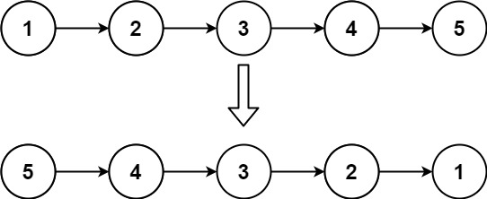

# Problem

Given the `head` of a singly linked list, reverse the list, and return _the reversed list_.

**Example 1:**

**Input:** head = [1,2,3,4,5]
**Output:** [5,4,3,2,1]

**Example 2:**

**Input:** head = [1,2]
**Output:** [2,1]

**Example 3:**

**Input:** head = []
**Output:** []

**Follow up:** A linked list can be reversed either iteratively or recursively. Could you implement both?
