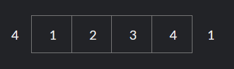
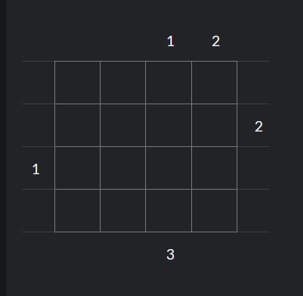
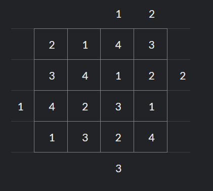
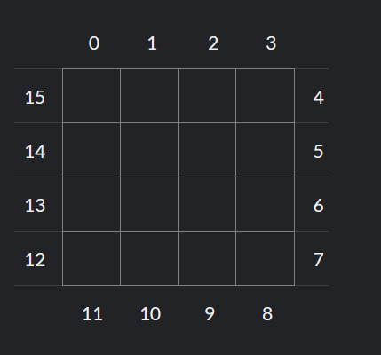

4 kyu

In a grid of 4 by 4 squares you want to place a skyscraper in each square with only some clues:

    The height of the skyscrapers is between 1 and 4
    No two skyscrapers in a row or column may have the same number of floors
    A clue is the number of skyscrapers that you can see in a row or column from the outside
    Higher skyscrapers block the view of lower skyscrapers located behind them

Can you write a program that can solve this puzzle?

Example:

To understand how the puzzle works, this is an example of a row with 2 clues. Seen from the left side there are 4 buildings visible while seen from the right side only 1:

There is only one way in which the skyscrapers can be placed. From left-to-right all four buildings must be visible and no building may hide behind another building:

Example of a 4 by 4 puzzle with the solution:

   	   	   	  
   	   	   	   	   	  
	  

Task:

    Finish:

function solvePuzzle(clues)

    Pass the clues in an array of 16 items. This array contains the clues around the clock, index:
 
    If no clue is available, add value `0`
    Each puzzle has only one possible solution
    `SolvePuzzle()` returns matrix `int[][]`. The first indexer is for the row, the second indexer for the column. (Python: returns 4-tuple of 4-tuples, Ruby: 4-Array of 4-Arrays)

If you finished this kata you can use your solution as a base for the more challenging kata: 6 By 6 Skyscrapers
